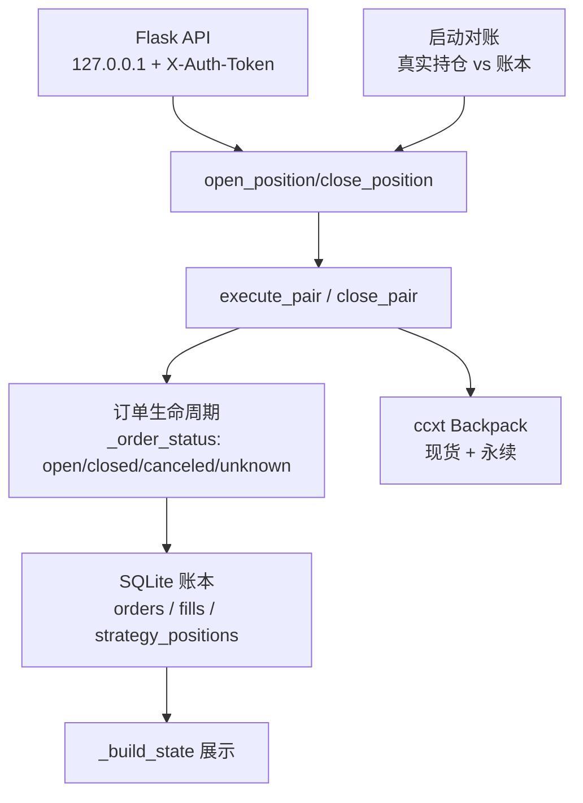

# 技术设计: 审计报告安全修复（P0/P1 缺陷修复 + 轻量账本）

## 技术方案

### 核心技术
- Python 3.10+ / Flask / ccxt 4.x
- sqlite3（Python 标准库，无新第三方依赖）
- 账本文件: `arb_ledger.db`（项目根目录，加入 .gitignore）

### 实现要点

#### 1. 价格方向与滑点控制
```python
def _cross_price(ccxt_sym, side, max_slippage_bps=20):
    bid, ask = _depth_bbo(ccxt_sym)
    slip = max_slippage_bps / 10_000
    if side == "buy":
        return ask * (1 + slip)   # 买入可成交价（吃卖一或更高）
    else:
        return bid * (1 - slip)   # 卖出可成交价（吃买一或更低）
```
- 开仓追单: 现货买入追单用 spot ask×(1+slip)；永续卖出追单用 perp bid×(1-slip)
- 平仓: 现货卖出用 spot bid×(1-slip)；永续买入用 perp ask×(1+slip) + reduceOnly

#### 2. 订单状态机（四态 + 增量记账）
```
fetch_order → {open, closed, canceled, unknown}
```
- OrderNotFound → 短暂重试(2 次) → 仍未知 → UNKNOWN
- UNKNOWN 处理: 不假定成交、不重发；该腿冻结并提示人工处理
- 记账规则: `delta = confirmed_filled - last_confirmed_filled`，仅 delta>0 时写 fills 并更新策略持仓
- 撤单后: 重新 fetch_order 确认最终 filled 再记账，再下剩余量新单

#### 3. 方向识别与合约换算
- `contracts` 保持 ccxt 符号（空头为负），`perp_base_qty = contracts × contractSize`（contractSize 从 markets[perp_sym] 读取）
- `_get_real_position` 返回带符号的现货量与合约基础资产量；`_build_state` 的 perp_qty 带符号展示（空头为负）
- 账户对冲量计算: `delta_usd = spot_qty×mark + perp_base_qty×mark`

#### 4. SQLite 账本
```sql
CREATE TABLE IF NOT EXISTS orders (
  id INTEGER PRIMARY KEY AUTOINCREMENT,
  order_id TEXT, client_order_id TEXT UNIQUE,
  symbol TEXT NOT NULL, market TEXT NOT NULL, side TEXT NOT NULL,
  intent TEXT NOT NULL, requested_amount REAL NOT NULL, price REAL,
  status TEXT, last_confirmed_filled REAL DEFAULT 0,
  reduce_only INTEGER DEFAULT 0, created_at TEXT, updated_at TEXT
);
CREATE TABLE IF NOT EXISTS fills (
  id INTEGER PRIMARY KEY AUTOINCREMENT,
  order_id TEXT, client_order_id TEXT, symbol TEXT, market TEXT,
  side TEXT, qty REAL NOT NULL, price REAL, ts TEXT
);
CREATE TABLE IF NOT EXISTS strategy_positions (
  symbol TEXT PRIMARY KEY, spot_qty REAL DEFAULT 0,
  perp_qty REAL DEFAULT 0, updated_at TEXT
);
CREATE TABLE IF NOT EXISTS tasks (
  id TEXT PRIMARY KEY, action TEXT, symbol TEXT, status TEXT,
  result TEXT, created_at TEXT, updated_at TEXT
);
```
- 账本写入与读写用同一 `sqlite3` 连接（`check_same_thread=False` + 锁），或每次操作新建连接（推荐，简单可靠）
- 启动对账: 真实持仓 vs 账本持仓；未知敞口 → `_unknown_exposure` 置位，禁止开仓

#### 5. 借贷参数按意图区分
| 场景 | autoBorrow | autoLend | autoLendRedeem |
|------|-----------|----------|----------------|
| 开仓现货买入 | ✅（借 USDC） | ✅ | — |
| 平仓现货卖出 | ❌ 禁止 | ✅ | ✅ |
- 平仓完成后验证 USDC 债务（collateral 中 borrow 字段，取不到则日志提示无法确认）

#### 6. 费率硬门槛
- 结算周期: `fr.get("fundingInterval")` 或 markets 的 fundingInterval，缺省 3600s
- `apy = rate × (86400/interval) × 365 × 100`
- 门槛: `rate <= 0 或 apy - EST_ROUND_TRIP_COST_APY < MIN_NET_APY` → 拒绝开仓
- 配置: `MIN_NET_APY = 10.0`（原 MIN_WEEK_APY 更名）、`EST_ROUND_TRIP_COST_APY = 5.0`

#### 7. leverage 参与名义计算
- `target_notional = notional × leverage`（前端 notional 视为本金）
- 保证金校验: `avail >= target_notional / leverage`（杠杆敞口占用），并校验 max_lev

#### 8. 部分成交立即追单 + 回滚
- 等待循环中任一条腿出现 >0 成交且另一腿未全成 → 立即撤未成腿并追单（不等整腿成交）
- 追单等待 HEDGE_TIMEOUT_S=5s；仍未成交 → 回滚已成交腿（滑点上限内 taker 平掉）
- 回滚失败 → 状态标记 EXPOSED，日志高亮，等待人工处理

#### 9. 服务安全
- `app.run(host="127.0.0.1")`
- POST 认证: `BPX_WEB_TOKEN` 环境变量；未设置时 DRY-RUN 自动生成随机 token 并注入页面；LIVE 未设置 → 拒绝启动
- LIVE 且无 API key → 拒绝启动
- 交易错误响应脱敏（不直接返回交易所原始错误）

#### 10. 任务模式
- POST /api/open、/api/close → `{ok, task_id}`，后台线程执行
- GET /api/task/<id> → `{status, result}`（result 含完整返回，不再丢弃）

## 架构设计



## 架构决策 ADR

### ADR-001: 采用 SQLite 账本而非内存状态
**上下文:** 原 position_state 为内存字典，进程重启丢失订单生命周期，无法支持撤单竞态与部分成交的可靠对账。
**决策:** 使用 Python 标准库 sqlite3 持久化 orders/fills/strategy_positions/tasks。
**理由:** 无新依赖、单文件、支持事务；审计明确建议 SQLite 或等价持久化。
**替代方案:** 完整状态机 + 独立事件库 → 拒绝原因: 对手动触发的单文件工具过度工程，回归风险大。
**影响:** 账本与交易所状态可能出现偏差，需启动对账机制兜底。

### ADR-002: 平仓归属采用"账本策略持仓"，而非子账户或 client order ID 全量归属
**上下文:** 审计要求平仓不得触碰人工持仓。
**决策:** 平仓量 = 账本 strategy_positions 记录量（再与 API 可卖量取 min 兜底）。
**理由:** client order ID 归属在订单被外部撤改时不可靠；独立子账户由用户运维侧决定。
**替代方案:** 唯一 clientOrderId 逐单归属 → 部分采纳（下单仍带 clientOrderId 便于追溯），平仓量以账本为准。
**影响:** 旧版本已开持仓不在账本内 → 启动对账会标记未知敞口并禁止新开仓，需人工确认。

### ADR-003: 追单失败优先回滚已成交腿
**上下文:** 审计要求达到滑点上限仍无法成交时优先回滚，而非继续裸露。
**决策:** 追单（带滑点上限的可成交限价）等待 5s 未成交 → 以同等滑点上限 taker 平掉已成交腿；失败标记 EXPOSED。
**理由:** 短时间未对冲即产生单边敞口，回滚是唯一确定性出口。
**影响:** 极端行情下回滚滑点可能超限，EXPOSED 状态下由人工处理。

## API设计

### POST /api/open
- **请求:** {symbol, notional, leverage, order_size?, timeout?} + Header X-Auth-Token（如配置）
- **响应:** {ok: true, task_id} | {ok: false, error}
- **变更:** 返回 task_id；后台执行；费率硬门槛在提交前校验

### POST /api/close
- **请求:** {symbol, order_size?} + Header X-Auth-Token（如配置）
- **响应:** {ok: true, task_id} | {ok: false, error}

### GET /api/task/<task_id>
- **响应:** {task_id, status: running/done/error, result}

### POST /api/cancel
- **变更:** 需 X-Auth-Token（如配置）

### GET /api/state
- **变更:** perp_qty 带符号展示（空头为负）；新增 ledger 状态与未知敞口标记

## 数据模型

见上方 SQLite schema（orders/fills/strategy_positions/tasks）。

## 安全与性能

- **安全:**
  - 只监听 127.0.0.1；POST 认证（X-Auth-Token）；错误响应脱敏
  - 实盘启动硬校验（缺 key/缺 token 拒绝启动）
  - 卖单禁止 autoBorrow；平仓 reduceOnly；费率硬门槛
- **性能:**
  - 账本为本地 sqlite3 轻量写入，单次交易操作 < 1ms
  - 费率缓存 TTL 60s 沿用
  - fetch_positions 一次性拉取（消除 N+1）沿用

## 测试与部署

- **测试:**
  - DRY-RUN 全链路（无 key 模式）跑通开仓/平仓/撤单/任务查询
  - 语法检查 `python -m py_compile`
  - 账本记账正确性: 部分成交增量、撤单重确认、重启后账本加载
  - 故障场景按审计"必须测试的故障场景"表逐项核对代码路径
- **部署:**
  - 保持 DRY-RUN 默认；验证通过后用户自行决定独立子账户小额测试
  - 版本 v4.0 → v5.0（行为变更 + 破坏性 API 变更）
