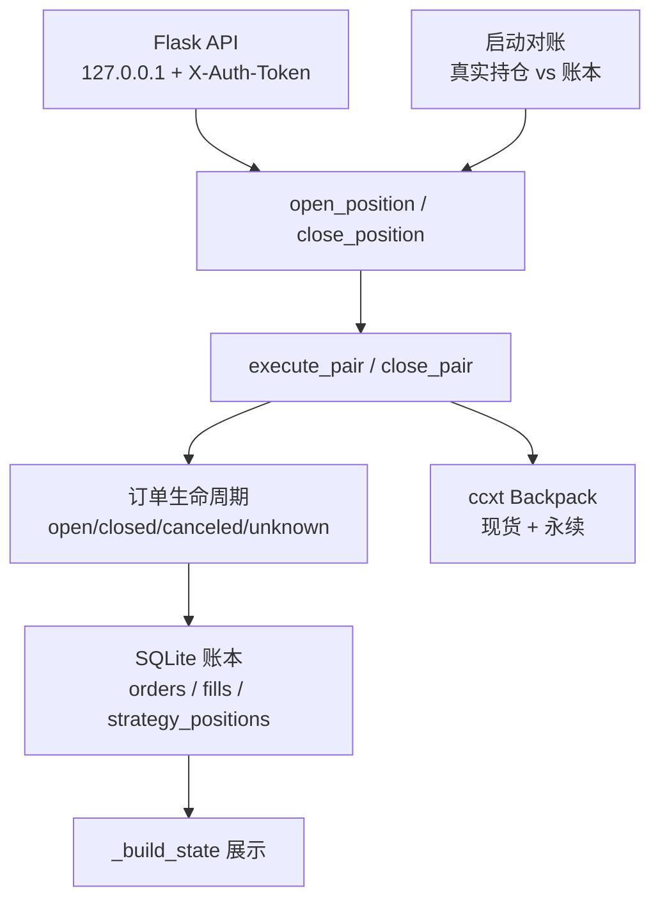
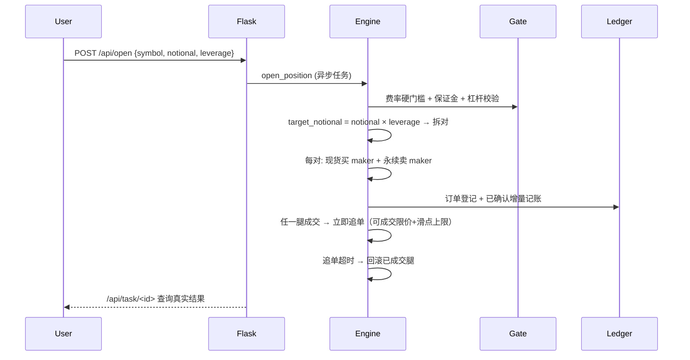
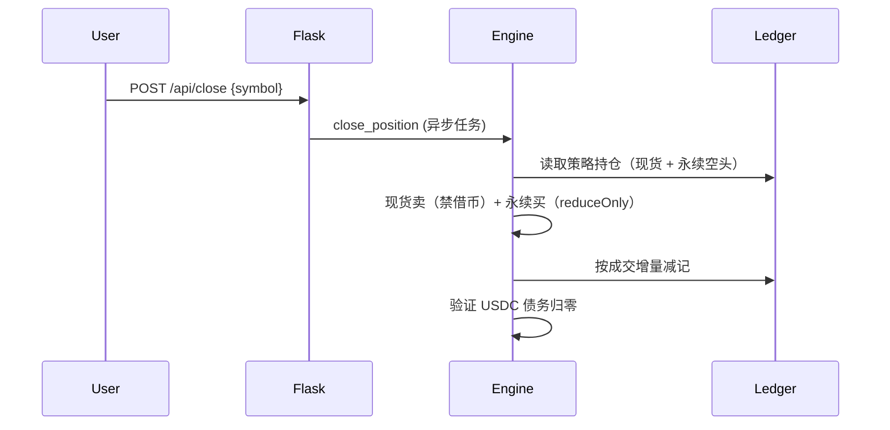

# 架构设计

## 总体架构

## 技术栈
- **后端:** Python 3.10+ / Flask 3.x / ccxt 4.x
- **前端:** 原生 HTML/JS（无框架，Flask render_template 注入 token）
- **数据:** SQLite（标准库，arb_ledger.db）

## 核心流程

### 开仓

### 平仓

## 重大架构决策

| adr_id | title | date | status | affected_modules | details |
|--------|-------|------|--------|------------------|---------|
| ADR-001 | 采用 SQLite 账本而非内存状态 | 2026-08-12 | ✅已采纳 | ledger, arb-engine | [详情](../../history/2026-08/202608121437_audit-fix/how.md#adr-001-采用-sqlite-账本而非内存状态) |
| ADR-002 | 平仓归属采用"账本策略持仓" | 2026-08-12 | ✅已采纳 | arb-engine | [详情](../../history/2026-08/202608121437_audit-fix/how.md#adr-002-平仓归属采用账本策略持仓而非子账户或-client-order-id-全量归属) |
| ADR-003 | 追单失败优先回滚已成交腿 | 2026-08-12 | ✅已采纳 | arb-engine | [详情](../../history/2026-08/202608121437_audit-fix/how.md#adr-003-追单失败优先回滚已成交腿) |
